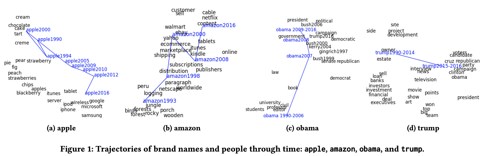
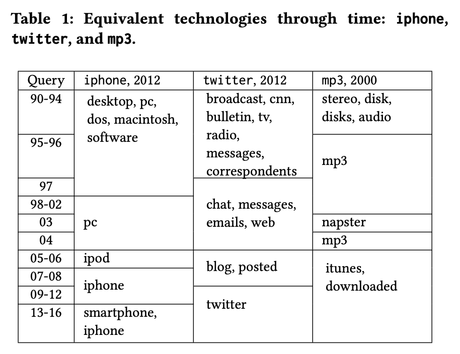

# Dynamic Word 2 Vec (DW2V)

implementation of dynamic word embedding based on  
[Dynamic Word Embeddings for Evolving Semantic Discovery.](https://arxiv.org/abs/1703.00607)

Examples from the paper  
  

# Usage
[WIP]
